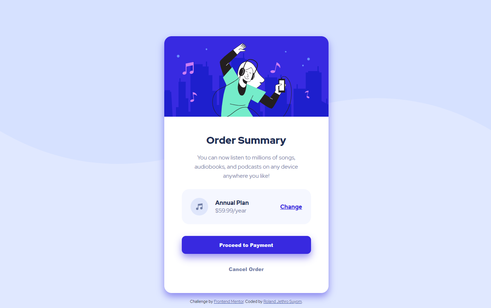

# Frontend Mentor - Order summary card solution

This is a solution to the [Order summary card challenge on Frontend Mentor](https://www.frontendmentor.io/challenges/order-summary-component-QlPmajDUj). Frontend Mentor challenges help you improve your coding skills by building realistic projects. 

## Table of contents

- [Overview](#overview)
  - [The challenge](#the-challenge)
  - [Screenshot](#screenshot)
  - [Links](#links)
- [My process](#my-process)
  - [Built with](#built-with)
  - [What I learned](#what-i-learned)
  - [Continued development](#continued-development)
  - [Useful resources](#useful-resources)
- [Author](#author)
- [Acknowledgments](#acknowledgments)

## Overview

### The challenge

Users should be able to:

- See hover states for interactive elements

### Screenshot

### Links

- Solution URL: [https://github.com/Jeth0214/FM-order-summary-component](https://github.com/Jeth0214/FM-order-summary-component)
- Live Site URL: [https://fe-mentor-order-component-challenge.netlify.app/](https://fe-mentor-order-component-challenge.netlify.app/)

## My process

### Built with

- Semantic HTML5 markup
- CSS custom properties
- Flexbox
- Mobile-first workflow

### What I learned

I learned how to set up a simple frontend project environment. Practice how to control the background image. How to add box shadow. Getting familiarize with Figma.

### Continued development

I want to improve my frontend skills by creating some projects. This month, I want to focus on creating responsive website.

### Useful resources

- [W3schools](https://www.w3schools.com/) - This help me understand on how HTML and CSS works.

## Author
- Frontend Mentor - [@Jeth0214](https://www.frontendmentor.io/profile/Jeth0214)
- Twitter - [@JethroSuyom](https://twitter.com/JethroSuyom)

